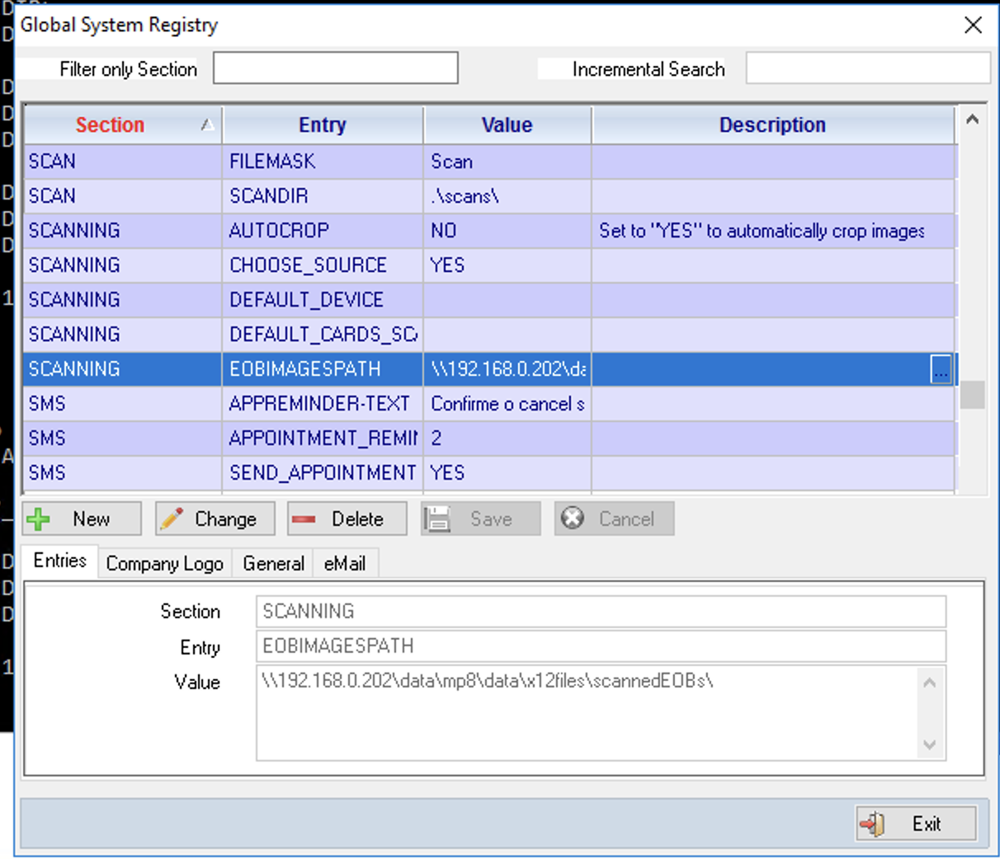
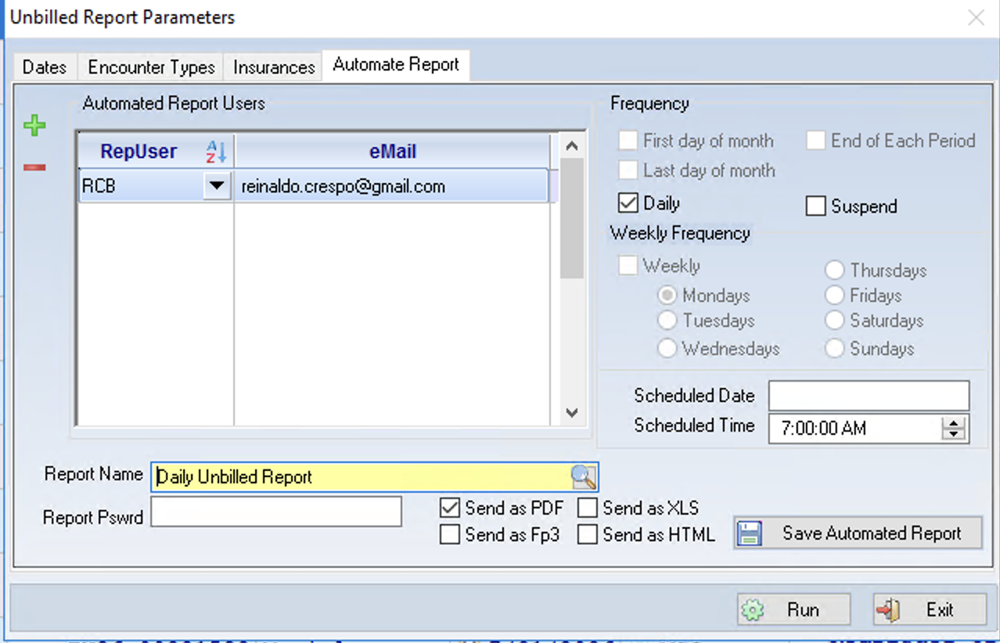

# About this guide

Mp10 includes a background service called **AutoTasks**. It runs unattended on
your server and takes care of work that would otherwise have to be done by hand
every day:

- taking a **backup** of your data on a schedule you choose, archiving it and
  checking the archive is sound,
- **collecting files from your clearinghouse** — remittances, claim status
  responses and acknowledgements — and posting them into Mp10,
- reading **remittance PDFs** downloaded from insurer portals,
- asking insurers whether a patient's **coverage is active**,
- texting patients an **appointment reminder** they can reply to,
- keeping a **modality worklist** in step with the schedule, so imaging
  equipment can be told who its next patient is, and
- running **reports** on a schedule and e-mailing them to whoever needs them.

Each of those is turned on separately. Nothing in this list happens until you
set the corresponding entry in the System Registry, with one exception noted in
its own chapter: eligibility requests default to on.

This guide is for the person who administers Mp10 at the practice. It does not
assume you are a programmer. It does assume you can open the **Admin10** module
and that you know where your practice keeps its shared folders.

Anything in this guide that must be done by whoever installed Mp10 (your IT
person or your reseller) is marked **IT task**.

> **A note on wording.** Throughout this guide, *setting* means an entry in the
> Mp10 System Registry — not the Windows registry. They are unrelated. Nothing
> in this guide requires you to open Windows' own registry editor.

# How AutoTasks works

AutoTasks runs as a Windows service on your Mp10 server. Once started it wakes
up at a fixed interval, checks whether there is anything to do, does it, and
goes back to sleep.

| Setting | Section | Default | What it does |
|---|---|---|---|
| `RUN_EVERY_N_SECONDS` | `AUTOTASKS` | `120` | How often the service wakes up, in seconds |

Two consequences worth understanding, because they explain most "why hasn't it
happened yet?" questions:

- **Nothing happens instantly.** If you drop a file into a folder, AutoTasks
  picks it up on its next wake-up — up to two minutes later by default.
- **Scheduled work fires on the first wake-up at or after the time you set**,
  not exactly on the second.

## The log file

AutoTasks writes everything it does to a log file sitting next to the service
program, named after it with a `.out` extension. On a typical install:

```
C:\Mp10\AutoTasks.out
```

This file is the single most useful thing to look at when something has not
happened. It is plain text — open it with Notepad. Every line is stamped with
the date and time.

The log is capped so it cannot fill the disk:

| Setting | Section | Default | What it does |
|---|---|---|---|
| `MAXIMUM_LOG_FILE_SIZE` | `GENERAL` | `8192` | Largest log size in KB before it is trimmed |

# Where settings live: the System Registry

All three capabilities in this guide are switched on and configured in one
place: **Admin10 → Global System Registry**.



Every setting has four parts:

| Column | Meaning |
|---|---|
| **Section** | The group a setting belongs to, e.g. `BACKUPS`, `SCANNING` |
| **Entry** | The name of the setting, e.g. `BACKUP_PATH` |
| **Value** | What you are setting it to |
| **Description** | A free-text note for whoever reads it next |

## Adding or changing a setting

1. Open **Admin10** and go to the **Global System Registry**.
2. To find an existing setting, type into **Filter only Section** (for example
   `BACKUPS`) or use **Incremental Search**.
3. Press **New** to add a setting, or select a row and press **Change** to edit
   one.
4. Fill in **Section**, **Entry** and **Value** in the *Entries* tab at the
   bottom.
5. Press **Save**.

> **Type the Section and Entry names exactly as shown in this guide.** They are
> matched by name. A misspelled entry is not an error — it is simply a setting
> nobody reads, so the feature stays switched off with no warning.

**AutoTasks re-reads its settings at the start of every cycle**, so a change
you make in the System Registry takes effect within a couple of minutes. There
is nothing to restart.

The exception is anything the service holds in memory rather than reads: the
daily jobs remember that they have already run today, so a backup that has
already failed today will not try again until tomorrow unless the service is
restarted (see *Backups*).

# Backups

AutoTasks can take an **Advantage Database Server hot backup** — a consistent
copy of your live data taken while people are still working in Mp10 — and
optionally compress it into a dated zip file, keeping only the most recent few.

## Turning backups on

Backups run only when **all three** of these are set. Leave any one of them
blank and no backup will ever run.

| Entry | Example | What it means |
|---|---|---|
| `BACKUP_PATH` | `\\adsserver\backup\mp10\` | Where the backup image is written |
| `BACKUP_TIMES` | `02:00:00` | Earliest time of day the backup may start |
| `BACKUP_DAYS` | `2345` | Which days of the week it may run |

All three go in section **`BACKUPS`**.

One optional setting lives with them:

| Entry | Example | Default | What it means |
|---|---|---|---|
| `BACKUP_MAX_HOURS` | `8` | `8` | How long the database backup may run before AutoTasks is treated as hung and restarted |

AutoTasks watches itself for hangs: if it stops responding, it restarts rather
than sitting there doing nothing all night. The database backup is the one step
that legitimately runs for hours, so it gets its own allowance, and
`BACKUP_MAX_HOURS` is it. Set it comfortably above the longest backup your site
has ever taken — the completion e-mail tells you what that is.

> **If a backup is cut short you are told about it.** AutoTasks notices at its
> next start that a backup was running when it stopped, and e-mails
> `Mp10 backup INTERRUPTED`. See *Being told what happened* below.

### BACKUP_PATH — read this carefully

This is the one setting people most often get wrong.

The backup is written by the **Advantage Database Server**, not by Mp10 and not
by your workstation. The path must therefore make sense *to the database server
process*:

- **UNC paths work** — `\\server\share\folder\`
- **Local drive letters on the database server work** — `D:\Backups\`
- **Mapped network drives do NOT work** — `Z:\Backups\` will fail, even if `Z:`
  is perfectly visible from your own PC

The account the Advantage service runs under must have permission to write
there. *(IT task.)*

### BACKUP_DAYS — the day codes

Days are given as a string of digits run together, one digit per allowed day:

| Digit | Day |
|---|---|
| 1 | Sunday |
| 2 | Monday |
| 3 | Tuesday |
| 4 | Wednesday |
| 5 | Thursday |
| 6 | Friday |
| 7 | Saturday |

So:

| Value | Meaning |
|---|---|
| `2345` | Monday through Thursday |
| `234567` | Monday through Saturday |
| `1234567` | Every day |
| `7` | Saturdays only |

### BACKUP_TIMES

A 24-hour time, `HH:MM:SS`. `02:00:00` means "any time from 2 a.m. onward".

Pick a time when the practice is quiet. A hot backup does not lock anybody out,
but it does work the server hard.

**A backup is attempted at most once per calendar day.** Once AutoTasks has
started one, it will not start another today, however many times it wakes up.

> **A failed attempt still counts as the day's attempt.** If the backup fails,
> AutoTasks does not keep retrying — it waits until tomorrow. This is
> deliberate: a hot backup runs for hours and hammering the database server all
> day cannot fix a wrong path or a full disk. It does mean **a failure needs
> somebody to act on it**, which is what the failure e-mail is for. If you fix
> the cause and want a backup the same day, restart the AutoTasks service.

## Optional: zipping and retention

If you also set a zip path, AutoTasks compresses each backup into a dated
archive, **reads that archive back to check it**, and only then prunes old ones.

| Entry | Example | Default | What it means |
|---|---|---|---|
| `BACKUP_ZIP_PATH` | `D:\Backups\Zips\` | *(blank)* | Where dated zips are written. Blank = do not zip |
| `MAX_BACKUPS_TO_KEEP` | `20` | `20` | How many zips to keep. Oldest beyond this are deleted |
| `ARCHIVE_MAX_HOURS` | `12` | `12` | How long the zip step may run before it is stopped and reported as failed |
| `FILES_TO_SKIP` | `oldtable.adt;temp.adt` | *(blank)* | Data files to leave out of the backup, separated by semicolons |

Zip files are named by date, so they sort chronologically:

```
Mp10Data-2026-07-31.zip
```

Unlike `BACKUP_PATH`, the zip path is used by AutoTasks itself, so an ordinary
path reachable from the Mp10 server is fine.

> **`MAX_BACKUPS_TO_KEEP` deletes files.** Once the number of zips in
> `BACKUP_ZIP_PATH` exceeds this number, the oldest are erased automatically.
> Keep that folder for backups only, and set the number to match the disk space
> you have.

### Files that cannot be compressed are copied instead

Not all data compresses. A memo file holding scanned documents is already
compressed — the scans are JPEGs or PDFs — and running it through compression
again reads every byte for nothing, making the result very slightly *larger*.

AutoTasks samples each file before adding it, and simply copies the ones
compression cannot help. The archive comes out the same size either way; the
difference is that no time is wasted on files that were never going to shrink.

> **A practice storing images in Mp10 should not expect a small archive.** If
> most of your data is scanned documents, the zip will be close to the size of
> the backup itself. That is the data, not a fault — and it means the archive
> folder needs roughly as much free space as the backup folder, for **each**
> archive you keep. Check `MAX_BACKUPS_TO_KEEP` against the free space you
> actually have.

### The archive is checked before it counts as a backup

An archive is not treated as a backup until AutoTasks has opened it again and
confirmed every file inside it is intact and the right size. Only then does it
delete anything older.

This matters more than it sounds. If the archive cannot be written or does not
check out, **nothing is deleted** — the previous archives are left exactly as
they were, and you get a failure e-mail. Older backups are never traded away
for a new one that might not work.

What happens to the failed archive depends on how it failed, because the two
cases are worth different things to you.

**It was written but did not check out.** The archive is complete and wrong.
That is worth keeping to look at, so it is renamed out of the way:

```
Mp10Data-2026-07-31.failed
```

Note the name replaces `.zip` rather than adding to it, so these can never be
mistaken for archives or counted as one.

**It ran out of room, or could not be written.** The file is truncated. There is
nothing to learn from half an archive, and keeping a partial copy of a very
large backup on a disk that has just filled up only makes the next night worse —
so it is deleted, and the failure e-mail says so.

**It took longer than `ARCHIVE_MAX_HOURS`.** The zip step is stopped, along with
everything it started, and the night is reported as a failed archive. Whatever
had been written by then is renamed to `.failed` in the same way, so it cannot
occupy one of your retention slots as though it were a good backup.

> **A slow archive is not a broken one.** `ARCHIVE_MAX_HOURS` exists only so a
> zip that will never finish cannot park AutoTasks on it indefinitely — it is
> not a target. The failure e-mail says how long the archive actually ran; if it
> was simply still working, raise this number rather than leaving the site with
> no archive. Zipping a large, image-heavy database can legitimately take many
> hours.

> **Kept `.failed` files are pruned, but only the most recent few survive.**
> They do not count towards `MAX_BACKUPS_TO_KEEP`; AutoTasks keeps the last
> three and erases older ones, naming each in the log and in the notice. Treat a
> `.failed` file as something to investigate, then delete it once you are done.

### Restoring from an archive

To get files back out of an archive, use the archiving program directly. From
the folder holding the AutoTasks program:

```
python backup_zip.py restore --zip "D:\Backups\Zips\Mp10Data-2026-07-31.zip" --target "D:\Restored"
```

To check an archive without extracting anything:

```
python backup_zip.py verify --zip "D:\Backups\Zips\Mp10Data-2026-07-31.zip" --mode full
```

`verify` finishes with a status of `0` when the archive is sound and `4` when it
is not, and writes what it found to `backup_zip.result.json`. The `full` check
reads every byte, so on a large archive it takes a while — that is why the
nightly run uses a faster structural check instead, and why this thorough one is
available to run by hand whenever you want reassurance.

Extracting files is only half of a recovery: what comes out of the zip is a
backup *image*, not a database anyone can log into. Turning it back into one is
covered in *Restoring the database* at the end of this chapter.

### What must be installed for backups to work

| What | Why | Where |
|---|---|---|
| Python 3 | Creates and checks the zip archive | `GENERAL` / `PYTHONPATH` — folder holding `python.exe`, with a trailing backslash. Blank = rely on the system `PATH` |
| `backup_zip.py` | The archiving program itself | Must sit in the same folder as the AutoTasks program |

> **If either is missing, no archive is created.** The database backup itself
> still runs and your data is still written to `BACKUP_PATH` — but there will be
> no zip, and you will get a failure e-mail saying so.

## Being told what happened

Backups run at night, when nobody is watching. AutoTasks e-mails a short report
each time one finishes — **whether it worked or not** — so you find out without
having to go and look.

| Entry | Example | Default | What it means |
|---|---|---|---|
| `NOTIFY_EMAIL` | `support@structuredsystems.com` | `support@structuredsystems.com` | Who to notify. Blank = do not send |

On a normal night you get **two** messages:

1. when the database backup finishes, and
2. when the zip archive finishes — this one also lists any older archives that
   were deleted to stay within `MAX_BACKUPS_TO_KEEP`.

The second message is the more useful of the two, because rotation is the only
part of the process that destroys anything, and this is the only record you get
of it.

```
The Mp10 backup archive was created and verified.

Data dictionary : \\adsserver\data\mp10\mp10.add
Archive         : D:\Backups\Zips\Mp10Data-2026-08-01.zip
Size            : 3072.0 MB (3,221,225,472 bytes)
Files archived  : 428
Source          : \\adsserver\backup\mp10\
Started         : 2026-08-01 04:37:11
Finished        : 2026-08-01 04:52:44
Duration        : 00:15:33
Verification    : headers - passed

Removed         : 2 older archive(s)
                  Mp10Data-2026-06-28.zip
                  Mp10Data-2026-06-29.zip
```

The **Verification** line is the one to read. If it is not there, or the subject
says FAILED, nothing was deleted and the archive should not be relied on.

### Sending to more than one person

`NOTIFY_EMAIL` takes as many addresses as you like. Separate them with commas
or semicolons — you can mix the two, and spaces around them do not matter:

```
support@structuredsystems.com; manager@yourpractice.com, it@yourpractice.com
```

Anything that is not an address is ignored rather than sent, so one typo in the
list does not stop the others receiving their copy. Look in `AutoTasks.out` for
`Backup notice sent to` to see how many recipients it actually used.

Delivery uses the same `eMail` settings as automated reports (see *Making sure
e-mail actually goes out*). If those are not configured, backups still run
normally; only the notification is lost, and the log records that it could not
be sent.

### When something goes wrong

Failures are e-mailed too, with `FAILED` in the subject so you can spot or
filter them. There are two, and they mean very different things.

**`Mp10 backup FAILED`** — the database backup did not happen. There is no new
copy of your data today. The message carries the error the database server
reported, which is usually enough to identify the cause:

```
The Mp10 hot backup FAILED.  NO BACKUP WAS TAKEN TODAY.

Data dictionary : \\adsserver\data\mp10\mp10.add
Destination     : \\adsserver\backup\mp10\
Started         : 2026-08-01 02:00:03
Failed          : 2026-08-01 02:00:09
Ran for         : 00:00:06

ADS error       : 7077
ADS message     : The specified path is invalid
```

**`Mp10 backup archive FAILED`** — less serious. The backup itself worked and
today's data is safe in `BACKUP_PATH`; only the zip step failed, so there is no
dated archive for today and **nothing was rotated or deleted**. Usually a full
disk, a permission problem on `BACKUP_ZIP_PATH`, or Python missing from the
server.

**`Mp10 backup INTERRUPTED`** — the backup started and AutoTasks stopped before
it finished. Whatever is in `BACKUP_PATH` is half a backup and must not be
relied on; earlier archives are untouched. The service was restarted, the server
rebooted, or the backup passed `BACKUP_MAX_HOURS` and the hang watchdog
restarted it. The log says which: look for a `WATCHDOG` line just before the
restart, and if it is there, raise `BACKUP_MAX_HOURS` — the backup was still
working when it was cut off.

A backup interrupted **today** is not retried today, for the same reason a
failed one is not: an hours-long backup that keeps being cut short would
otherwise restart every couple of minutes for the rest of the day. The e-mail
says which case you are in.

The message names what actually went wrong and where to look. Two files next to
the AutoTasks program carry the detail:

| File | What is in it |
|---|---|
| `backup_zip.log` | What the archiver did, file by file, and why it stopped |
| `backup_zip.stdout.log` | Anything Python itself printed. **Look here first if `backup_zip.log` does not exist at all** — that combination means Python could not start |

> **A failure e-mail means no backup today, and none is coming without you.**
> AutoTasks does not retry after a failure — see *BACKUP_TIMES* above — so the
> message is not a warning about a passing glitch. Somebody has to fix the cause
> and, if the practice cannot go a day without a backup, restart the service.

Silence still means something is wrong: if the service itself is stopped, it
cannot send anything at all. A night with no message of any kind is worth
looking into.

### E-mail has to be set up first

The notices go out through the practice's outgoing mail server, configured in
the `eMail` section (see *Making sure e-mail actually goes out*). If that has
not been set up, AutoTasks does not attempt to send at all — it writes a line to
`AutoTasks.out` naming the settings that are blank and carries on.

Backups themselves are unaffected either way. Notification is the last step, and
nothing about it can stop a backup from running or succeeding.

## A working example — backups

| Section | Entry | Value |
|---|---|---|
| `BACKUPS` | `BACKUP_PATH` | `\\adsserver\backup\mp10\` |
| `BACKUPS` | `BACKUP_TIMES` | `02:00:00` |
| `BACKUPS` | `BACKUP_DAYS` | `234567` |
| `BACKUPS` | `BACKUP_ZIP_PATH` | `D:\Backups\Zips\` |
| `BACKUPS` | `MAX_BACKUPS_TO_KEEP` | `30` |
| `BACKUPS` | `NOTIFY_EMAIL` | `support@structuredsystems.com; manager@yourpractice.com` |
| `GENERAL` | `PYTHONPATH` | `C:\Program Files\Python313\` |

This takes a backup Monday through Saturday, any time after 2 a.m., zips it to
a local disk, checks the archive, keeps the last 30 zips, and e-mails two people
when it is done.

## Backups are not a disaster recovery plan on their own

A backup that has never been restored is a hope, not a backup. Copy the zips
off-site — or at minimum onto a different physical machine — and test a restore
periodically. AutoTasks writes the file and checks that it is readable; making
sure it survives a fire, a theft or a ransomware event is a decision only the
practice can make.

Restoring is a single command, and it is worth running once so you know it works
before you ever need it:

```
python backup_zip.py restore --zip "D:\Backups\Zips\Mp10Data-2026-07-31.zip" --target "D:\RestoreTest"
```

That command brings the files back out of the zip. Making a working database
out of them is the next section.

## Restoring the database

Unzipping an archive is not a restore. The files the nightly backup writes
look like a database — tables, memo files, a data dictionary — but Advantage's
own documentation is blunt about them: they exist solely to be restored from,
and reading them directly produces unpredictable results. Indexes are not in
the backup at all. What turns a backup image back into a database people can
log into is the **restore**, and it is done from the Admin program.

There are two steps. The first is only needed when the copy you want is inside
a zip.

### Step 1 — get the backup image onto a disk the server can reach

Last night's backup is already sitting in `BACKUP_PATH`, unzipped. If that is
the copy you want, skip straight to step 2.

For an older or off-site copy, extract the archive first, exactly as shown in
*Restoring from an archive*:

```
python backup_zip.py restore --zip "D:\Backups\Zips\Mp10Data-2026-07-31.zip" --target "D:\RestoreTest"
```

Where you extract it matters. The restore in step 2 is carried out by the
Advantage service **on the server**, so the same rule as `BACKUP_PATH`
applies: the extracted folder must be on the server itself, or on a share the
server machine can read. A drive letter that exists only on your workstation
means nothing to the server.

### Step 2 — restore with Admin10

Start Admin10 and log in with user code `adssys`. ADSSYS is Advantage's own
administrator account, not an ordinary Mp10 user — its password is the
database administrator password, and the restore option does not appear on
the menu for anyone else.

> **If your ADSSYS password is still whatever it was on installation day,
> change it.** Anyone holding it can do everything described here, including
> overwriting a database.

Then pick **File → Restore DB From Backup**. It asks for three things:

| Field | What to enter |
|---|---|
| Backup image `.add` path | The dictionary file inside the backup image — e.g. `D:\RestoreTest\mp10.add`, or the `.add` directly under `BACKUP_PATH` |
| Backup dictionary password | The ADSSYS password **as it was when that backup was taken**. If the password has changed since, an old image still wants the old password |
| Destination `.add` path | Where the restored database should be created — e.g. `D:\RestoredDb\mp10.add` |

Both paths are read by the server, so the workstation-drive-letter rule above
applies to them too. Both must end in `.add`.

> **The destination must never be the live data directory.** A restore
> overwrites whatever is at the destination. Restore to a new or scratch
> directory, look at the result, and only then decide what to do with it —
> pointing the practice at a restored copy is a deliberate step, best taken
> with support on the line.

A restore can take a long time on a large database — every table is copied
and every index is rebuilt from scratch, which is work the nightly backup
skipped. A progress window shows that the restore is alive, how long it has
been running and, once the server starts reporting it, how far along it is.
Once the server starts reporting progress the restore can be cancelled from
that window; a cancelled restore leaves an incomplete copy at the
destination, which should be deleted before trying again.

When it finishes you have a complete, working copy of the practice's
database at the destination — dictionary, tables and freshly built indexes —
completely separate from the live one. That is also the cheapest reassurance
there is: restore into a scratch folder once in a while, log into the copy,
and you know the night the archive is actually needed, it will work.

### When there is no working database to log into

The instructions above assume you can start Admin10 normally. On the day you
most need a restore that may not be true: Admin10 connects to a data
dictionary at start-up, and the reason you are restoring may be that there is
no longer a dictionary to connect to.

There is a way in, and it is worth knowing *before* the bad day.

**Point Admin10 at the backup image itself.** A backup image contains its own
`mp.add`, so it is a data dictionary in its own right and Admin10 can log
into it like any other. Start it with the backup folder as the path:

```
PrAdmin10.exe PATH:e:\adsdata\sfi-2026\backup\
```

Give the path of the *folder* holding the backup's `mp.add`, with a trailing
backslash — Admin10 adds the dictionary name itself. (The same thing can be
done by changing the `PATH` entry in `mp10.ini`, but the command line leaves
the file alone, which is one less thing to put back afterwards.)

Log in as `adssys` using **the ADSSYS password as it was when that backup was
taken**, then use **File → Restore DB From Backup** exactly as described
above. You are now connected to the backup, but you still restore *from* it,
naming its `.add` as the source and a fresh folder as the destination.

> **Use that session for the restore and nothing else.** Advantage is explicit
> that backup files exist to be restored from and that reading them directly
> "can produce unpredictable results" — indexes are not even included in a
> backup. Admin10 may also tell you the data dictionary version is older than
> the program expects; that notice is informational and you should ignore it
> here. Never run a structure update against a backup image — that is your
> only copy of the data, and it is not the thing to be experimenting on.

**If Admin10 cannot open the dictionary at all**, it now offers the restore
by itself. When the connection fails for any reason other than a rejected
password, it asks:

```
The data dictionary could not be opened:
   \\server\share\data\mp.add
   ADS error 7077

Restore a database from a backup image now?
```

Answer yes and you get the restore dialog directly, without logging in —
Advantage allows a restore to run on a bare connection to a directory, with
no dictionary involved. Answer no and you get the familiar offer to create a
new dictionary instead.

Two things about that prompt are deliberate. It does **not** appear when the
password was simply wrong, so it is not a way around the login. And once the
restore is done Admin10 closes, because it still has no dictionary — start it
again pointing at the restored folder, and you are back to a normal session.

### The restore utility: MpRestore10

Both routes above still go through Admin10, a program built around having a
database. There is also a small separate one that is not:

```
MpRestore10.exe
```

It sits beside the other Mp10 programs and does exactly one thing. There is
no login, because there is no dictionary to log into. It asks only for a
folder on the server to connect through, and then shows the same restore
dialog described earlier, with the same three fields.

The folder it asks for is **not** the database — it is any folder the
Advantage service itself can read, used purely to reach the server. Your data
folder is the obvious choice and is offered as a starting point (taken from
`mp10.ini`), but if that is the part that has gone missing, any other folder
on the server does just as well. The usual rule applies: it must be a path
the *server* can resolve, so UNC paths and drive letters local to the server
work, while a drive mapped on your own PC does not.

> **The Advantage service has to be running.** A restore is carried out by
> the Advantage Database Server itself, not by the program in front of you.
> Advantage's own documentation is flat about it: *"Online backup and restore
> functionality is only supported with the Advantage Database Server."*
> Advantage Local Server — the mode where there is no service, just files on
> disk — cannot restore a backup at all, and no Mp10 program can work around
> that. If the machine holding your data has no Advantage service running,
> the service is the first thing to fix.

The path can also be given on the command line, handy for a recovery shortcut
prepared in advance:

```
MpRestore10.exe PATH:\\server\share\mp10data\
```

> **Prepare this before you need it.** Check once, on a calm afternoon, that
> MpRestore10 starts and connects — and while you are there, run a restore
> into a scratch folder with it. A recovery tool nobody has ever opened is
> the same kind of promise as a backup nobody has ever restored.

# Automatic error report e-mails

When something goes wrong in a desktop program — PrBill10, Patients10, any of
them — Mp10 already asks the person at the keyboard whether to send a report
to Structured Systems. What this adds is what happens to that report
**whether or not they say yes**: every error a desktop program hits is
recorded regardless, and AutoTasks e-mails anything that has not already been
sent on its next wake-up (every two minutes by default — see *How AutoTasks
works*, above). A user declining to send no longer means the report is lost;
it just waits for AutoTasks to pick it up.

## Errors are grouped, not listed one by one

The same error often happens more than once — on the same workstation, or on
several. AutoTasks does not send one e-mail per occurrence. It sends **one
message per distinct error**, however many times it happened, and the message
says how many times and where.

Each message tells you:

- which program and which build,
- which workstations and users hit it, and when it was first and last seen,
  and
- the list of program locations the error passed through — the stack — so
  Structured Systems can see where it happened.

It deliberately leaves out the detailed diagnostic dump — the full parameter
and variable listing stays in the database, not in your inbox. **It also
leaves out machine details:** CPU, memory and the free-resources figures are
recorded with the error but never e-mailed. If Structured Systems needs those
to chase a resource-exhaustion problem, they come from the database, not from
this message.

## Turning it on

**It ships switched off.** There is no default address — until an
administrator sets one, nothing is sent, ever.

| Entry | Example | Default | What it means |
|---|---|---|---|
| `NOTIFY_EMAIL` | `support@structuredsystems.com` | *(none — blank)* | Who to notify. Blank = do not send. **This is what switches the feature on** |
| `MAX_ROWS_TO_KEEP` | `1000` | `1000` | How many error reports to keep before the oldest already-sent ones are deleted. Pruning is part of the error-report pass, so **while `NOTIFY_EMAIL` is blank, or while e-mail itself is not set up, this setting does nothing at all**. Once both are in place it is applied on every wake-up, whether or not there is anything to send — so lowering it takes effect within a couple of minutes on a quiet site, not only after the next error |
| `MAX_GROUPS_PER_RUN` | `10` | `10` | Most distinct errors e-mailed on any one wake-up; anything left over waits for the next one |

All three live in section **`ERRORREPORTS`**.

Delivery uses the same mail settings as backups and automated reports — see
*E-mail has to be set up first*, above. If those are not configured,
AutoTasks does not attempt to send an error report either, and the log
records that it could not be sent.

## A worked example

This is reproduced exactly as AutoTasks composes it — labels, spacing and all
— because that is what will actually land in your inbox:

```
Subject: [PrBill10.exe] BASE/1005|POSTPAYMENT|2214 - 4x on 2 station(s)

Signature : BASE/1005|POSTPAYMENT|2214
Program   : PrBill10.exe  build 931
Occurred  : 4 time(s)
First seen: 2026-07-30 09:14:02
Last seen : 2026-08-01 11:47:55

Stations and users (oldest to newest)
   FRONTDESK-2         jsmith              2026-07-30 09:14:02   ErrorNum 8841
   FRONTDESK-2         jsmith              2026-07-30 15:02:11   ErrorNum 8852
   BILLING-1           mrivera             2026-08-01 08:30:47   ErrorNum 8901
   BILLING-1           mrivera             2026-08-01 11:47:55   ErrorNum 8919

Stack (most recent report)
------------------------------------------------------------
Called from:POSTPAYMENT(2214)
Called from:APPLYBALANCE(861)
Called from:_BEND(0)
------------------------------------------------------------
Full detail -- including the variables dump and machine/resource stats omitted from this e-mail -- is in SystemErrors.
```

The program name in both the subject and the `Program` line is the file name
of the running executable, spelled exactly as it sits on disk — `PrBill10.exe`,
not `PRBILL10.EXE`. The `build` figure is the internal build number the program
was compiled with (a plain counter such as `931`), not the dictionary version.

The signature — `BASE/1005|POSTPAYMENT|2214` above — is an internal
fingerprint, not a sentence. It is the part that decides which occurrences
belong together: the error subsystem and code (`BASE/1005`), then the routine
and the line number inside it. Two occurrences with the same signature are
treated as the same error and arrive in one message.

The first line of the message and its closing sentence use internal labels
rather than plain English. They are quoted here exactly because that is what
will arrive in your inbox — the rest of this guide talks about "the error
report" and "the record kept in the database," not those names.

## If sending fails

If the mail server is unreachable or rejects the message, AutoTasks retries
on later wake-ups. After three failed attempts it gives up on that report and
records the fact in the log — see *The log file*, above.

## What gets deleted, and what never does

Once the number of error reports on file goes over `MAX_ROWS_TO_KEEP`,
AutoTasks deletes the oldest ones to bring it back down — but only reports
that have already been sent. **A report that has never been sent is never
deleted to make room for a new one.** If your site is generating errors
faster than they can be e-mailed, the table grows past the keep-limit rather
than losing a report nobody has seen yet.

## Where to look when nothing arrives

Everything this feature does — including whether each message actually got
out — is written to `AutoTasks.out`, the same log backup notices use. If an
error happened and no e-mail followed, that is the first place to look.

# Electronic remittances: the two kinds

Payment advices reach a practice in two different shapes, and AutoTasks handles
them with two separate mechanisms. They are configured independently, in
different sections of the System Registry, and turning one on does nothing for
the other.

| | **X12 835 files** | **EOB / ERA PDFs** |
|---|---|---|
| What it is | The standard electronic remittance format, a data file | A printed advice saved as a PDF |
| Where it comes from | A clearinghouse, usually downloaded automatically | Downloaded by hand from an insurer's portal |
| Turned on by | `AUTOTASKS` / `PROCESS_835` | `SCANNING` / `EOBIMAGESPATH` |
| Folder settings live in | `X12FILE_PATH` | `SCANNING` |
| Needs Python | No | Yes |

If your clearinghouse delivers 835 files, that is the path to use — it carries
more detail and needs no interpretation. The PDF route exists for payers who
will only give you a printed advice.

Both post into the same remittances table once processed.

# Collecting files from the clearinghouse

Rather than have somebody log into the clearinghouse portal and download files
by hand, AutoTasks can collect them itself on a schedule. One mechanism brings
down everything the clearinghouse has routed to you.

## What gets collected

The clearinghouse tags each file it sends with a document type. AutoTasks saves
each one with that type at the front of the file name, so you can tell at a
glance what arrived:

| Arrives as | What it is | Processed by |
|---|---|---|
| `835_…​.txt` | An electronic remittance — a payment | *X12 835 electronic remittances* |
| `277_…​.txt` | A claim status response — what the payer did with a claim | *Claim status responses (277)* |
| `EDI_…​.txt` | An acknowledgement or notice about a claim submission | *Claim acknowledgements (EDI)* |

> **Everything lands in one folder — the one named by `X12FILE_PATH` / `835`** —
> whatever its type. That folder is the clearinghouse in-tray, not the "835
> folder", despite the setting's name. Each processor then picks out the files
> belonging to it. This is why the 835 processor only looks at names containing
> `835`.

A file that has already been collected is not written a second time: AutoTasks
checks both the in-tray and the history folder before saving.

## Turning collection on

| Section | Entry | Example | What it means |
|---|---|---|---|
| `AUTOTASKS` | `GetRoutedFiles` | `YES` | Collect files from the clearinghouse. Anything other than `YES` = off |
| `AUTOTASKS` | `GetRoutedFilesStartTime` | `07:00:00` | Earliest time of day it may run. Blank = no lower bound |
| `AUTOTASKS` | `GetRoutedFilesEndTime` | `19:00:00` | Latest time of day it may run. Blank = no upper bound |
| `AUTOTASKS` | `GetRoutedFilesFrequency` | `60` | Minutes to wait between runs on the same day |
| `AUTOTASKS` | `GetRoutedFilesDays` | `23456` | Which days it may run on, using the same day codes as `BACKUP_DAYS` |

> **Collection stops at 7 p.m. regardless of what you set.** There is a fixed
> cut-off in the program, described in the log as *"Past working hrs not
> fetching routed files to give Inmediata a rest."* Setting
> `GetRoutedFilesEndTime` later than `19:00:00` will not extend collection past
> it.

## The clearinghouse account

| Section | Entry | What it means |
|---|---|---|
| `X12WebService` | `UserName` | Clearinghouse user name |
| `X12WebService` | `Password` | Clearinghouse password |
| `X12WebService` | `FileTransfer_Url` | The file-transfer service address |
| `X12WebService` | `TimeOut` | How long to wait for a response, in milliseconds. Default `30000` |
| `X12WebService` | `MarkDownloadsAsDownloaded` | `NO` (recommended) — see below |

## `MarkDownloadsAsDownloaded` — leave this alone unless asked

Once a file is marked as downloaded, the clearinghouse will not offer it again.
When that marking happens is the whole question.

- **`NO` (the default, and the safe choice).** AutoTasks fetches the files,
  writes them to disk, and *then* tells the clearinghouse they were collected.
  If the download is interrupted or the disk is full, nothing was marked, so the
  clearinghouse still has the files and the next run collects them again.
- **`YES`.** The files are marked as downloaded as part of the fetch itself,
  before AutoTasks has written anything. If the run fails at that point, the
  clearinghouse considers the files delivered and **will not offer them again** —
  they would have to be retrieved from the portal by hand.

Set it to `YES` only if the clearinghouse specifically asks you to.

## Checking it is working

```
GetRoutedFiles
7 routed files downloaded
\\server\data\x12files\835_20260803074113.txt
\\server\data\x12files\277_20260803074115.txt
```

A run that finds nothing logs `0 routed files downloaded`, which is normal
outside business hours or when the clearinghouse has nothing new.

# X12 835 electronic remittances

An 835 is the standard electronic remittance file. AutoTasks can collect them
from the clearinghouse, read them, post the payments, and file the used ones
away — with no manual step at all once it is set up.

## The journey of an 835 file

```
   clearinghouse
        |
        |  (1) downloaded  -- AUTOTASKS / GetRoutedFiles
        v
   X12FILE_PATH / 835              <- the working folder
        |
        |  (2) processed  -- AUTOTASKS / PROCESS_835
        v
   payments posted into Mp10
        |
        |  (3) filed away
        v
   X12FILE_PATH / 835_COPY_PATH    <- the history folder
```

The file is **copied** to the history folder and then **erased** from the
working folder. Erasing is the point: it is what stops the same remittance being
processed again the next time round.

## Step 1 — Create the two folders

You need two folders, and **both must exist before you start**. AutoTasks does
not create them for you.

| Folder | Purpose |
|---|---|
| Working folder | Where 835 files arrive and wait to be processed |
| History folder | Where they are filed after they have been posted |

Requirements:

- The AutoTasks service account needs permission to **read, write and delete**
  in the working folder — it erases files there once they are safely filed.
- It needs permission to **write** in the history folder.
- Keep them separate. Do not make the history folder a subfolder that the
  working folder's file search would find.
- Do not use the working folder for anything else.

## Step 2 — Declare the folders

| Section | Entry | Example value | What it means |
|---|---|---|---|
| `X12FILE_PATH` | `835` | `\\server\data\x12files\` | The working folder — where 835 files are read from |
| `X12FILE_PATH` | `835_COPY_PATH` | `\\server\data\x12files\history\` | The history folder — where they are moved after posting |

Include the trailing backslash on both.

> **`835_COPY_PATH` is not optional in practice.** If you leave it blank,
> processed files are never erased from the working folder, so AutoTasks finds
> and reprocesses the same remittances on every single cycle, for ever. The same
> happens if the history folder does not exist or cannot be written to: the copy
> fails, so the erase is skipped. **If you see the same remittances being
> processed over and over, this is why.**

## Step 3 — Turn processing on

| Section | Entry | Value | What it means |
|---|---|---|---|
| `AUTOTASKS` | `PROCESS_835` | `YES` | Read and post 835 files. Anything other than `YES` = off |

## Step 4 — Optional: collect the files automatically

AutoTasks can fetch files from the clearinghouse itself, so nobody has to
download anything by hand. That mechanism collects remittances, claim status
responses and acknowledgements together — see *Collecting files from the
clearinghouse* below.

If you leave `GetRoutedFiles` off, everything else still works; somebody just
has to put the 835 files into the working folder themselves.

## Two things that catch people out

**The file name has to contain `835`.** AutoTasks only looks at files whose name
includes those three digits — `*835*`. A remittance saved as `remit_0731.txt`
will sit in the folder untouched, for ever, with nothing in the log to say why.
If files are being ignored, check the name first.

**Files older than six months are skipped.** Anything more than 180 days old is
left alone and noted in the log as `File more than 6 mo old`. This stops an old
archive folder being reposted by accident. If you genuinely need to post
something older, it has to be done by hand.

## A working example — 835 files

| Section | Entry | Value |
|---|---|---|
| `AUTOTASKS` | `PROCESS_835` | `YES` |
| `X12FILE_PATH` | `835` | `\\server\data\x12files\` |
| `X12FILE_PATH` | `835_COPY_PATH` | `\\server\data\x12files\history\` |
| `AUTOTASKS` | `GetRoutedFiles` | `YES` |
| `AUTOTASKS` | `GetRoutedFilesStartTime` | `07:00:00` |
| `AUTOTASKS` | `GetRoutedFilesEndTime` | `19:00:00` |
| `AUTOTASKS` | `GetRoutedFilesFrequency` | `60` |
| `AUTOTASKS` | `GetRoutedFilesDays` | `23456` |

This collects remittances from the clearinghouse once an hour, Monday to Friday,
between 7 a.m. and 7 p.m., posts them, and files them into the history folder.

## Checking it is working

At startup AutoTasks writes the state of each X12 folder into `AutoTasks.out`:

```
X12 835 dir  \\server\data\x12files\  exists
```

If that line says the folder is missing, nothing else in this chapter will work.
During a run you will see how many files were found:

```
ProcessAll835OnDir  12 Files found on \\server\data\x12files\
```

Then, as each is filed away, the copy and the erase are both logged. A file that
is found but never erased is the signature of a history-folder problem — see the
warning under *Step 2*.

# Claim status responses (277)

A 277 tells you what the payer did with a claim you submitted — accepted,
rejected, pending, and why. AutoTasks reads them and posts the status against
the claim, so the billing staff can see it without logging into a portal.

| Section | Entry | Value | What it means |
|---|---|---|---|
| `AUTOTASKS` | `PROCESS_277` | `YES` | Read and post 277 files. Anything other than `YES` = off |
| `X12FILE_PATH` | `277` | `\\server\data\x12files\` | The folder 277 files are read from |
| `X12FILE_PATH` | `277_COPY_PATH` | `\\server\data\x12files\history\` | Where they are filed after posting |

The same rule as for 835 files applies: **the history folder must exist and be
writable**, or the file is never erased and gets reprocessed on every cycle.

> **`X12FILE_PATH` / `277` and `X12FILE_PATH` / `835` should normally name the
> same folder.** Automatic collection puts *everything* it downloads into the
> folder named by the `835` entry — including 277s. If the `277` entry points
> somewhere else, downloaded 277 files will sit in the in-tray and never be
> processed. Unless you have a specific reason to separate them, set both to the
> same path.

AutoTasks accepts three shapes of status file: a standard X12 277, an XML status
report, and a tab-delimited validation report. It works out which it is by
reading the file, so you do not have to tell it.

A file that is not any of those is left alone and logged as `Unlegit 277`. That
line is normal in a shared in-tray — it is what an 835 looks like to the 277
reader — and is not an error.

# Claim acknowledgements (EDI)

When you submit claims, the clearinghouse sends back acknowledgements saying it
received them. AutoTasks reads these and records them against the claims.

| Section | Entry | Value | What it means |
|---|---|---|---|
| `AUTOTASKS` | `ProcessEDIs` | `YES` | Read acknowledgement files. Anything other than `YES` = off |
| `X12FILE_PATH` | `277` | `\\server\data\x12files\` | Read from the same folder as 277s |
| `X12FILE_PATH` | `277_COPY_PATH` | `\\server\data\x12files\history\` | Filed here afterwards |

There are no separate path settings — acknowledgements use the 277 pair.

> **Low-level acknowledgements are deleted, not filed.** Files named `TA1_…`,
> `_TA1_…`, `999_…` and `_999_…` are transport-level receipts that carry nothing
> a practice needs. AutoTasks erases them on sight to stop them accumulating.
> They are **not** copied to the history folder first, so if you want to keep
> them for an audit, this is not the mechanism that will do it.

# Insurance eligibility (270 / 271)

AutoTasks can ask insurers whether a patient's coverage is active — a 270
request out, a 271 response back — and store the answer against the patient, so
front-desk staff see current coverage without phoning anyone.

| Section | Entry | Default | What it means |
|---|---|---|---|
| `AUTOTASKS` | `AutoSend_270` | `NO` | Send eligibility requests. Anything other than `YES` = off |
| `X12FILE_PATH` | `270` | `\\server\data\x12files\` | Working folder for eligibility files |

> **On an existing installation this is probably already set to `YES`.** Earlier
> versions turned eligibility on by default, and that value was written into the
> System Registry the first time the service ran. Changing the default does not
> change what is already stored. If you do not want eligibility requests going
> out, check the `AutoSend_270` entry and set it to `NO` yourself.

## When it happens

There is no schedule to configure. Eligibility runs on **every service cycle**,
alongside the other tasks, and asks about three groups:

1. **Patients** whose insurance record was added or changed recently
2. **Claims** awaiting submission
3. **Encounters** being prepared

## Why a patient might not be checked

This is the part that generates support calls, because nothing appears in the
log to explain a patient who was skipped. A patient's insurance record is only
asked about when **all** of these are true:

- the insurance plan is flagged to fetch eligibility — `isFetch271` ticked on the
  plan record in **Planfile**
- the plan has its **Submitter**, **Receiver** and **GS03** identifiers filled in
- the insurance record was added or changed **within the last 7 days**
- there is a **member/contract number** on the record
- it is the patient's **primary** insurance
- no eligibility response has already come back since the record was last changed

The first two are the usual culprits, and they live on the **plan**, not the
patient. If eligibility works for one insurer and not another, compare their
plan records before looking anywhere else.

The 7-day window is deliberate: it checks coverage that has recently changed
rather than re-asking about every patient in the practice every day. To force a
re-check on an older record, open and re-save it — that updates its modified
date and brings it back into the window.

# Appointment reminders by text message

Appointments entered in the calendar can be confirmed by text, so the practice
finds out about a cancellation before the slot is wasted rather than after.

AutoTasks watches **every appointments table in the data dictionary** — any
table whose name contains `appntmnts` — so a practice running more than one
calendar is covered without extra configuration.

## How a reminder happens

```
   appointment entered in the calendar
        |
        |  (1) unconfirmed, and inside the alert window
        v
   added to the SMS queue (SMSMessages)
        |
        |  (2) sent through Twilio
        v
   patient's mobile
        |
        |  (3) patient replies to confirm
        v
   appointment marked confirmed
```

Queueing and sending are separate steps, both on every service cycle. A message
that cannot be sent stays in the queue and is retried.

## The settings

| Section | Entry | Example | Default | What it means |
|---|---|---|---|---|
| `SMS` | `SEND_APPOINTMENT_REMINDERS` | `YES` | `NO` | The on/off switch |
| `SMS` | `APPOINTMENT_REMINDERS_ALERT_DAYS` | `3` | `3` | How many days ahead to look. **Must be more than 0 or nothing is sent** |
| `SMS` | `APPREMINDER-TEXT` | see below | *(blank)* | The message itself |
| `SMS` | `COOLING_PERIOD` | `1` | `1` | Hours to wait after an appointment is changed before texting about it |
| `SMS` | `MAX-DAILY-SMS` | `100` | `100` | Most messages to send in one day, as a spend guard |
| `SMS` | `SMS_STATUS_CALLBACK_URL` | *(a web address)* | *(blank)* | Where Twilio reports delivery status. Blank = no delivery reporting |

The Twilio account lives in its own section — **IT task**:

| Section | Entry | What it means |
|---|---|---|
| `TWILIO` | `ACCOUNT_SID` | Twilio account identifier |
| `TWILIO` | `AUTH_TOKEN` | Twilio authentication token |
| `TWILIO` | `TEL_FROM` | The number messages are sent from |

## Writing the message

`APPREMINDER-TEXT` is the text the patient receives. Three placeholders are
replaced as each message is built:

| Placeholder | Replaced with |
|---|---|
| `[date]` | The appointment date and time, e.g. `08/05/2026 2:30 PM` |
| `[tel]` | The patient's mobile number |
| `[guid]` | The appointment's internal reference, for use in a confirmation link |

For example:

```
Reminder: your appointment is on [date]. Reply C to confirm or R to reschedule.
```

> Keep it short. Long messages are split and billed as more than one.

## Which appointments get a reminder

An appointment is texted when **all** of these are true:

- it is in the future, and within `APPOINTMENT_REMINDERS_ALERT_DAYS` days
- it has **not** already been confirmed or cancelled
- no reminder has been sent for it already
- there is a mobile number of at least 10 digits on the appointment
- the appointment has a real time on it, not `00:00:00`
- it was last changed more than `COOLING_PERIOD` hours ago

**One text per patient per day, however many appointments they have.** If a
patient is booked twice on the same day, they get a single reminder about the
first. This is deliberate — it stops a patient with a morning and an afternoon
slot receiving two texts.

## Keeping the cost under control

`MAX-DAILY-SMS` is a hard stop. Once that many messages have been sent today,
the queue is left alone until tomorrow and the log records why:

```
Maximum number of SMS reached.  Total used: 100  Maximum set to: 100
```

If reminders stop partway through a busy day, this is the first thing to check.
The messages are not lost — they stay queued and go out the following day, by
which time the appointment may have passed.

# Electronic remittances (EOB / ERA PDFs)

Insurers publish payment advices — remittance notices, ERAs, EOBs — to their
provider portals as PDF files. AutoTasks can read those PDFs and post the
payments into Mp10 automatically, so nobody has to key them in.

This is the **PDF** route. If your payer sends X12 835 files instead, see the
previous chapter — the two are configured separately.

## What you have to do

1. **Choose a folder** where remittance PDFs will be saved.
2. **Declare that folder** in the System Registry.
3. **Save PDFs into it** as you download them.

That is the whole workflow. Everything after step 3 is automatic.

## Step 1 — Choose the folder

Any folder the Mp10 server can reach. A share on your file server is the usual
choice, so that billing staff can drop files in from their own workstations.

Requirements:

- The AutoTasks service account needs permission to **read, write and delete**
  in it. It does not merely read the PDFs — it moves them when it is done.
- If more than one person will save files there, give them all write access.
- Do not point it at a folder used for anything else. AutoTasks processes and
  then moves *every* PDF it finds there.

## Step 2 — Declare the folder

| Section | Entry | Example value |
|---|---|---|
| `SCANNING` | `EOBIMAGESPATH` | `\\192.168.0.202\data\mp8\data\x12files\scannedEOBs\` |

The screenshot in *Where settings live* shows exactly this entry being edited.

> **Setting this value is the on/off switch.** There is no separate "enable"
> setting. If `EOBIMAGESPATH` has a value, remittance processing is on; if it is
> blank, it is off. Include the trailing backslash.

It takes effect on the next cycle — a couple of minutes — with nothing to
restart.

## Step 3 — Save your remittance PDFs there

Download the remittance PDF from your insurer's portal as you normally would,
and save it into the folder. Nothing else is required — you do not need to
rename the file or record it anywhere.

Guidelines:

- **One remittance per PDF.** If the portal offers a combined download of many
  checks, prefer separate files.
- **Let the download finish before AutoTasks wakes up.** Saving directly into
  the watched folder over a slow connection can expose a half-written file. If
  that is a risk, save to your desktop and move the finished file in.
- **Do not put anything else in the folder.** Non-remittance PDFs will be read,
  found to contain nothing usable, and left behind.

## What happens next

On its next wake-up, for each PDF in the folder, AutoTasks:

1. **Reads the PDF.** It first tries to read the text directly. If the PDF is a
   scan with no text in it, it falls back to optical character recognition.
2. **Writes a `..._eob.json` file** beside the PDF holding what it found — the
   check number and date, the payee, and every claim and service line.
3. **Checks the remittance belongs to your practice** (see below).
4. **Posts the payments** into the remittances file, ready to be applied.
5. **Moves the PDF** into a `history` sub-folder so it is not processed twice:

```
...\scannedEOBs\history\C6472004.pdf
```

> **Create the `history` sub-folder yourself.** Unlike the 835 history folder,
> this one has no setting — it is always a folder called `history` directly
> inside `EOBIMAGESPATH`, and AutoTasks does not create it. If it is missing, or
> the service account cannot write to it, the PDF cannot be moved and the same
> remittance is read again on every cycle.

If you want to know what happened to a particular file, search `AutoTasks.out`
for its name.

## If your server serves more than one practice

A single AutoTasks server can serve several practices, each with its own data
dictionary, all watching the same folder.

AutoTasks reads the **payee** — the provider the cheque was made out to — from
each remittance and compares it against the NPIs and provider numbers registered
for the practice it is currently connected to.

- If they **match**, the remittance is posted and the PDF is moved to `history`.
- If they **do not match**, the file is **left exactly where it is**, untouched,
  so the run connected to the practice that owns it can pick it up.

You do not need to sort remittances by practice, and nothing is lost if a file
is downloaded into the wrong practice's queue.

> If a remittance carries no identifiable payee at all, it is treated as yours
> and processed. Most payer layouts do print one; some do not.

## What must be installed on the server

*(IT task — but if remittances are not being read, this is the first thing to
check.)*

| Component | Purpose | Registry setting |
|---|---|---|
| Python 3 | Runs the extractor | `GENERAL` / `PYTHONPATH` — folder holding `python.exe`, with a trailing backslash |
| `extract_eob.py` | The extractor itself | Must sit in the same folder as the AutoTasks program |
| Poppler | Renders scanned PDFs to images | Installed at `C:\Mp10\poppler\Library\bin` |
| Tesseract OCR | Reads text out of scans | Installed at `C:\Program Files\Tesseract-OCR` |

Poppler and Tesseract are needed **only for scanned remittances**. If your
insurers all publish normal text PDFs, remittances will process without them.

A second log, `python_debug.log`, is written next to the AutoTasks program and
holds the extractor's own output. It is the place to look if a specific PDF
fails.

# Automated reports

Any Mp10 report can be scheduled to run by itself and be e-mailed out. You set
this up from the report itself, not from a central screen.

## Setting up a report

Open the report you want as you normally would, set its parameters, then go to
the **Automate Report** tab.



### Who receives it

In **Automated Report Users**, press the green **+** and pick a user from the
**RepUser** drop-down. Their e-mail address fills in beside them. Add as many
recipients as you need; the red **−** removes the selected one.

> The address comes from the user's Mp10 record. If it is wrong or missing, fix
> it on the user, not here.

### When it runs

Tick one of the **Frequency** options:

| Option | Runs |
|---|---|
| **Daily** | Every day |
| **Weekly** | Once a week, on the day you select on the right |
| **First day of month** | On the 1st |
| **Last day of month** | On the last day of the month |
| **End of Each Period** | On your billing period's closing day |
| **Suspend** | Not at all — see below |

**Scheduled Date** runs the report once, on that specific date, instead of
repeating.

**End of Each Period** uses the day-of-month set in
`BILLING` / `DAYS_INTO_MONTH_BEFORE_CLOSING`.

### What time it runs

**Scheduled Time** sets the time of day. If you leave it blank the system
default is used:

| Setting | Section | Default |
|---|---|---|
| `AUTO_REPORTS_TIME` | `AUTOTASKS` | `22:00:00` |

> **A report is only queued for a time that has not yet arrived today.** If it
> is 3 p.m. and you schedule a daily report for 2 p.m., it will not run this
> afternoon — it starts tomorrow. When setting up a report you want to see
> today, pick a time that is still ahead of you, or use **Run** to produce it
> immediately.

### What format it arrives in

Tick one or more of **Send as PDF**, **Send as XLS**, **Send as Fp3**, **Send as
HTML**. PDF is the usual choice. XLS is worth ticking when the recipient will
want to sort or total the figures themselves.

**Report Pswrd** puts a password on the attachment. Use it for anything leaving
the practice.

### Naming and saving

Give it a clear **Report Name** — this is what identifies the scheduled job and
what recipients will see. `Daily Unbilled Report` is a better name than
`report1`.

Press **Save Automated Report**. Press **Run** to test it right away without
waiting for the schedule.

## Stopping a report

Tick **Suspend** and save. The job stays configured, with its recipients and
settings, but stops running. Untick it to resume.

This is preferable to deleting a report you may want back.

## Making sure e-mail actually goes out

Scheduled reports are e-mailed through the practice's outgoing mail server. If
that is not configured, reports will run and produce nothing anybody sees.

These live in section **`eMail`** *(IT task)*:

| Entry | Example | What it is |
|---|---|---|
| `SMTP-ServerName` | `smtp.gmail.com` | Outgoing mail server |
| `SMTP-Port` | `465` | Its port |
| `SMTP-User` | `reports@yourpractice.com` | Account used to send |
| `SMTP-Pass` | *(password)* | Its password |
| `Address` | `reports@yourpractice.com` | Address messages come from |
| `SMTP-Auth` | `YES` | Whether the server requires a login |
| `SENDMETHOD` | `CDO` or `SMTP` | How mail is sent |

> **If you use Gmail or Microsoft 365**, an ordinary account password will not
> work. You need an app-specific password, and the account must permit it. This
> is the most common reason scheduled reports stop arriving after an otherwise
> unrelated IT change.

## Keeping a copy on disk

To have every automated report also written to a folder — useful as an audit
trail, or to feed a shared drive:

| Section | Entry | Example |
|---|---|---|
| `AUTOREPORTS` | `COPY_TO_PATH` | `\\fileserver\mp10\reports\` |

Leave it blank to skip.

# Modality worklist (imaging)

If your practice has imaging equipment — a CT, an ultrasound, an X-ray room —
the **modality worklist** is how each machine finds out who its next patient
is. Instead of a technologist typing the name, date of birth and accession
number at the console, the machine asks Mp10 and fills its own screen in.

That matters for more than convenience. A study labelled by hand is a study
that can be labelled wrongly, and a mistyped accession number is what makes an
image arrive in the wrong patient's file.

> **This chapter covers the AutoTasks half only.** AutoTasks decides which
> studies belong on the worklist and writes one small file per study. A
> **DICOM worklist server** — a separate piece, installed once on your server —
> is what the machines actually query, and it serves those files. Without it,
> AutoTasks is writing files nothing reads.
>
> If you are setting this up for the first time, read the **Mp10 Modality
> Worklist** guide instead: it covers both halves, installing the server,
> pointing a scanner at it, and what to do when the worklist looks empty. This
> chapter is the AutoTasks settings reference that guide refers back to.

## Turning it on — two separate switches

There are two, in this order, and the order matters:

```
   Admin10 -> Global System Registry
        |
        |  (1) GENERAL / MODALITY-WORKLIST = YES
        v
   run a file check in Admin10
        |                     -> the modalitywl table is created
        v
        |  (2) AUTOTASKS / EXPORT_MWL = YES
        v
   restart AutoTasks
                              -> the table is filled, and kept current
                                 on every cycle from then on
```

### Why the settings are already there, set to `NO`

The first time Mp10 looks for a setting and does not find it, **it creates the
entry itself**, set to its default, with a description of what it does. So the
first time you go looking for `MODALITY-WORKLIST` you will probably find it
already present and set to `NO`.

That is not a fault and not somebody else's change — it is Mp10 writing down a
question it just asked. Once the entry exists, **your value always wins**;
Mp10 never overwrites a value you have set.

### Step 1 — create the table

| Section | Entry | Set to |
|---|---|---|
| `GENERAL` | `MODALITY-WORKLIST` | `YES` |

Then **run a file check in Admin10**. The table is created during that check
and at no other time.

> **Order matters.** The file check reads this setting as it runs. Setting it
> to `YES` *after* a check has finished does nothing until the **next** check.
> If you have just changed it, run the check again.

### Step 2 — turn the reconcile on

| Section | Entry | Set to |
|---|---|---|
| `AUTOTASKS` | `EXPORT_MWL` | `YES` |

That takes effect on the next cycle, a couple of minutes later; settings are
re-read every cycle and nothing needs restarting.

## The settings

| Section | Entry | Example | Default | What it means |
|---|---|---|---|---|
| `GENERAL` | `MODALITY-WORKLIST` | `YES` | `NO` | Whether the `modalitywl` table exists at all. Read during a file check, not by AutoTasks |
| `AUTOTASKS` | `EXPORT_MWL` | `YES` | `NO` | The on/off switch for keeping the table current |
| `AUTOTASKS` | `MWL_SPOOL_PATH` | `C:\Mp10Mwl\worklists` | *(blank)* | Where the worklist files are written. **Must match the worklist server's own setting exactly.** Blank means no files are written |
| `AUTOTASKS` | `MWL_WINDOW_DAYS` | `1` | `1` | How far either side of today to look, in days |
| `AUTOTASKS` | `MWL_UID_ROOT` | *(blank)* | *(blank)* | **IT task.** Leave blank unless your organisation owns a registered DICOM root |

### `MODALITY-WORKLIST` — whether the table exists

Leave this `NO` and the table is never created, nothing else in this chapter
applies, and no harm is done. Practices with no imaging equipment should leave
it alone.

Setting it back to `NO` later does **not** delete the table or its contents. It
only stops future file checks from maintaining it.

### `EXPORT_MWL` — whether the table is kept current

With this `NO`, the table sits exactly as it was last left. With it `YES`,
AutoTasks re-checks the whole worklist against your schedule on every cycle —
by default every two minutes.

### `MWL_SPOOL_PATH` — where the worklist files go

The worklist server watches one directory. This tells AutoTasks to write into
that same directory, and the two settings must name **exactly the same place**.

Leave it blank and the table is still kept current but no files are written —
which is a reasonable way to run for a while before the imaging side exists,
and is what the log line `no .wl written -- AUTOTASKS/MWL_SPOOL_PATH is empty`
is telling you.

> **Wrong path, empty worklist, no error.** If the two settings disagree, each
> half does exactly what it was told: AutoTasks writes files, the server serves
> the empty directory it was pointed at, and nothing anywhere reports a
> problem. The scanner simply shows nothing. `Test-Mwl.ps1` on the server
> compares the two in one line, and is the fastest way to rule this out.

**AutoTasks owns that directory.** It writes what belongs there and deletes
everything else in it — that is how a cancelled study disappears from the
machines. Do not keep anything else in it.

### `MWL_WINDOW_DAYS` — how wide the window is

`1` means yesterday, today and tomorrow. `0` means today only. `7` means a
fortnight centred on today.

> **Widen this with care.** Everything inside the window is a live worklist
> entry that a technologist has to look past to find today's patient. A window
> of `30` is not a longer list so much as a worse one. Change it only if orders
> are genuinely being scheduled that far ahead.

Narrowing it does not lose anything permanently — see *Cancelling is not
deleting* below.

### `MWL_UID_ROOT` — how studies are identified *(IT task)*

Every study needs an identifier that is unique **worldwide**, not just within
your practice, because images may end up in systems shared with other
organisations.

Left blank — the default, and the right answer for almost everyone — Mp10 mints
one from a scheme designed for exactly this and requiring no registration.

Fill it in **only** if your organisation genuinely owns a registered DICOM
root. Digits and dots only.

> **Do not invent a value here.** An invented root is not merely untidy: it can
> collide with identifiers issued by whoever really owns it, and two different
> studies sharing an identifier is a problem that surfaces years later, in
> somebody else's archive.

Changing this later is safe. Identifiers already issued are **never rewritten**
— only newly-scheduled studies use the new root — so an existing study is never
split in two.

## Which orders appear on the worklist

An order is on the worklist when **all** of these are true:

- its encounter is **not** inactive,
- its encounter is **not** closed, and
- its start date falls within `MWL_WINDOW_DAYS` days either side of today.

Where an order has no start date of its own, the encounter's admission date is
used instead.

There is nothing to switch on per order and nothing to tick. An order that
meets those three tests is on the worklist; one that stops meeting them comes
off it.

## What happens on each cycle

AutoTasks works out the list from scratch every time, rather than trying to
remember what changed. That is deliberate: it means a missed cycle, a service
restart or a crash cannot leave the worklist permanently out of step. The next
cycle simply puts it right.

Each pass does four things:

1. **Works out which orders belong** on the worklist right now.
2. **Adds** the ones that are not there yet, and **puts back** any that had been
   cancelled but now qualify again.
3. **Cancels** anything on the worklist that no longer qualifies.
4. **Writes a file for every study a machine should see**, and **deletes every
   other file** in the worklist directory. That last sweep is what actually
   withdraws a cancelled study from the machines.

Step 4 rewrites a file only when its content has changed — or when the file has
gone missing, which is how a directory somebody has cleaned out repairs itself
on the next cycle.

## Cancelling is not deleting

When an order falls off the worklist — the encounter is closed, or the date
moves out of the window — its entry is **marked cancelled, not removed**.

This matters if it comes back. Re-open the encounter, or move the date back
into the window, and the *same* entry is reinstated with the *same* study
identifier. The study is never split into two half-studies in your image
archive.

The one case that does remove an entry outright is deleting the order itself,
which is as it should be — an order that no longer exists cannot be scanned.

## Telling the machine what kind of study it is

A worklist entry has to say whether the study is a CT, an ultrasound, an X-ray
and so on. Mp10 works that out from the **revenue code** on the order: each
revenue code carries the kind of imaging it represents.

Until those are filled in, entries are still created correctly in every other
respect — they simply do not say what kind of study they are, which is not
enough for a machine to act on. **This is a one-off data job**, done once per
practice, and AutoTasks tells you how much of it is left (below).

## What the log tells you

Every cycle writes a handful of lines to `AutoTasks.out`. Search it for
`WriteWorklistFiles`:

| Line | What it means |
|---|---|
| `active set size` | How many orders qualify for the worklist right now |
| `inserted` / `re-activated` / `unchanged` | What this cycle changed. On a quiet cycle all three are `0` and that is correct |
| `cancelled` | How many entries came off the worklist this cycle |
| `rows with a rev_code but no revcodes.Modality mapped` | How many entries cannot say what kind of study they are — with example revenue codes, so you know which ones to fill in. **This number should fall to zero** as the mapping is completed |
| `rows with no items/RevCode match at all` | Orders whose item does not resolve to a revenue code at all. Usually a catalogue problem rather than a worklist one |

Then search it for `EmitWorklistFiles` — that is the part the machines see:

| Line | What it means |
|---|---|
| `written` | Files written this cycle. High on the first run of the day, then usually `0` |
| `unchanged` | Studies already published and unaltered. This is the number that should match what a scanner sees |
| `purged` | Files removed — cancelled studies, studies past the window, and anything else that was in the directory |
| `no modality (not emitted)` | Studies held back because their revenue code does not say what kind of study they are. **These are invisible to every machine.** Non-imaging orders — laboratory, office visits — are counted here too and belong here |
| `write failures` | Should always be `0`. Anything else is a permissions or disk problem on the worklist directory |
| `published with NO station` | How many studies carry no imaging station. They answer a modality-and-date query but are invisible to a scanner filtering by station AE title. The line names example location/modality pairs — those are the missing **Imaging Stations** rows |
| `station routing is OFF` | The imaging stations table is absent or unreadable. The worklist is still published; nothing is routed |
| `no .wl written -- AUTOTASKS/MWL_SPOOL_PATH is empty` | The path is not set, so nothing is published |
| `ABORTED -- AUTOTASKS/MWL_SPOOL_PATH does not exist` | The path is set but wrong, or the directory was deleted |

A healthy log on a normal day shows a steady `active set size`, small or zero
change counts, a zero mapping count, and `written 0 / unchanged <today's
studies>` on most cycles.

## Running one cycle by hand

You do not have to wait two minutes and read around everything else the service
does. On the server:

```
AutoTasks.exe --mwl-run
```

That runs **one worklist cycle and nothing else** — no backup, no remittances,
no e-mail, no texts — and prints the same lines to the screen. It is safe to
run in the middle of a working day, and it is the quickest answer to "is the
worklist right *now*".

# Troubleshooting

Start with `AutoTasks.out`. Search it for the date you expected something to
happen. Almost every question below is answered by a line in that file.

## Nothing at all is happening

| Check | How |
|---|---|
| Is the service running? | Windows **Services**, look for the Mp10 AutoTasks service *(IT task)* |
| Is it writing to the log? | Check the timestamp on `AutoTasks.out` — it should update every couple of minutes |
| Were settings changed less than a cycle ago? | Wait one cycle — they are re-read every time, no restart needed. If a change has still not taken effect after that, check the spelling of the entry: a misspelt one is a setting nobody reads |

## The backup never runs

| Symptom | Likely cause |
|---|---|
| Nothing in the log about a backup | One of `BACKUP_PATH`, `BACKUP_TIMES`, `BACKUP_DAYS` is blank — all three are required |
| "Backup started" then an error | The path is not reachable *by the database server*. Check for a mapped drive letter; use UNC instead |
| Runs some days but not others | Check the digits in `BACKUP_DAYS` against the day-code table — 1 is Sunday, not Monday |
| Ran once, never again the same day | Working as designed — one backup per calendar day |
| Zips are disappearing | `MAX_BACKUPS_TO_KEEP` is pruning them. Raise it or move zips off elsewhere |

## No backup e-mail arrived

Check the log first — it distinguishes "the backup did not run" from "it ran but
the e-mail did not go out", and those need different fixes.

| In `AutoTasks.out` | Meaning |
|---|---|
| `Backup notice sent to N recipient(s)` | It was sent. Look in the recipients' spam folder |
| `Backup notice FAILED to send to` | The mail server rejected it — check the `eMail` settings |
| `Backup notice could not be sent (mail error)` | The mail server could not be reached at all |
| `notifications are switched off` | `NOTIFY_EMAIL` is blank |
| `holds no usable address` | Nothing in `NOTIFY_EMAIL` looks like an address — check for a typo |
| Nothing at all about a notice | The backup itself never completed. See *The backup never runs* |

| Symptom | Likely cause |
|---|---|
| Only one message instead of two | The second comes from the zip step. If `BACKUP_ZIP_PATH` is blank there is nothing to archive, and the first message says so |
| Some recipients got it, others did not | An entry in the list is not a valid address and was skipped. The log line gives the count actually used |
| A `FAILED` message, then nothing more that day | Working as designed — AutoTasks does not retry a failed backup until the next day |
| No message at all, on a night you expected one | The service is not running, or never reached the backup. Silence is not confirmation — check the log |
| `No outgoing mail server is configured` in the log | The `eMail` settings are blank. The backup still ran; only the notice was skipped |
| `already sent today; not repeating` in the log | A notice of that kind had already gone out today |

## Remittance PDFs are not being picked up

| Symptom | Likely cause |
|---|---|
| Files sit in the folder, nothing in the log | `SCANNING` / `EOBIMAGESPATH` is blank or misspelled, or the service was not restarted |
| "belongs to another practice - left in place" | Working as designed — the cheque is payable to a different practice on this server |
| The file was read but no payments appeared | The claims on it could not be matched. The log names each claim it could not resolve |
| Log mentions the extractor failing | Look in `python_debug.log`. Usually Python or the extractor script is missing from the server |
| Only scanned remittances fail | Poppler or Tesseract is not installed |

Once processed, the PDF is in the `history` sub-folder — it has not been lost.

## 835 files are not being processed

| Symptom | Likely cause |
|---|---|
| The same remittances are processed over and over | `X12FILE_PATH` / `835_COPY_PATH` is blank, or the history folder does not exist, or the service cannot write to it. The copy fails, so the erase is skipped. This is the most common 835 problem |
| Files sit in the folder, nothing in the log | `AUTOTASKS` / `PROCESS_835` is not `YES`, or the service was not restarted after changing it |
| Some files are processed, others ignored entirely | The ignored ones do not have `835` in the file name. Only `*835*` is looked at |
| `File more than 6 mo old` in the log | Working as designed — anything over 180 days is skipped |
| `X12 835 dir ... does not exist` at startup | `X12FILE_PATH` / `835` is wrong, or is a Windows path on a Linux server |
| `is not a legit 835` in the log | The file is not a valid 835 — often an acknowledgement or a report the clearinghouse routed alongside the remittances |
| Nothing is ever downloaded | `AUTOTASKS` / `GetRoutedFiles` is not `YES`, today is not in `GetRoutedFilesDays`, or the time is outside the start/end window |
| `Error connecting to Host` in the log | The `X12WebService` user name or password is wrong, or the server cannot reach the clearinghouse |

## Nothing is being downloaded from the clearinghouse

| Symptom | Likely cause |
|---|---|
| `0 routed files downloaded`, every time | Normal if the clearinghouse has nothing new. If it never changes, check `AUTOTASKS` / `GetRoutedFiles` is `YES` |
| Nothing after 7 p.m. | Working as designed — there is a fixed cut-off no setting can move |
| Nothing on certain days | Today is not in `GetRoutedFilesDays` |
| `Error connecting to Host` | `X12WebService` user name or password, or the server cannot reach the clearinghouse |
| Files download but 277s are never processed | `X12FILE_PATH` / `277` points somewhere other than `X12FILE_PATH` / `835`. Everything is downloaded into the `835` folder |
| A file was collected once and never again | It was marked as downloaded at the clearinghouse. Retrieve it from the portal by hand |

## Claim statuses or acknowledgements are not appearing

| Symptom | Likely cause |
|---|---|
| Nothing happens at all | `AUTOTASKS` / `PROCESS_277` or `ProcessEDIs` is not `YES` |
| The same files process repeatedly | `X12FILE_PATH` / `277_COPY_PATH` is blank, missing, or not writable |
| `Unlegit 277` in the log | Normal — that is a file in the shared in-tray that is not a 277, most often an 835 |
| Acknowledgements vanish without reaching history | Working as designed — `TA1_` and `999_` files are deleted, not filed |

## Eligibility is not being checked

| Symptom | Likely cause |
|---|---|
| No patients at all are checked | `AUTOTASKS` / `AutoSend_270` has been set to something other than `YES` |
| One insurer works, another does not | The failing insurer's plan record: `isFetch271` not ticked, or Submitter / Receiver / GS03 blank |
| An established patient is never checked | Their insurance record has not changed in the last 7 days. Re-save it to bring it back into the window |
| A secondary insurance is ignored | Only the primary is checked |

## The modality worklist is empty or wrong

| Symptom | Likely cause |
|---|---|
| The `modalitywl` table was never created | `GENERAL` / `MODALITY-WORKLIST` was set to `YES` *after* the last file check, not before. Run the file check again |
| The table exists but stays empty | `AUTOTASKS` / `EXPORT_MWL` is not `YES`, or the service was not restarted after it was set |
| `active set size` is `0` but there are orders today | Their encounters are closed or inactive — both are excluded — or the order dates fall outside `MWL_WINDOW_DAYS` |
| Everything is suddenly cancelled | `MWL_WINDOW_DAYS` was narrowed, or a batch of encounters was closed. Nothing is lost; widen it or re-open them and the same entries come back |
| Entries exist but say nothing about the kind of study | The revenue-code mapping is not filled in. The log line counting these names example revenue codes to start with |
| The table looks right but no files are written | `AUTOTASKS` / `MWL_SPOOL_PATH` is blank or names a directory that does not exist. The `EmitWorklistFiles` log line says which |
| Files are written but a scanner sees nothing | The two halves are pointed at different directories, or the DICOM server is not running. Run `Test-Mwl.ps1` on the server; the **Mp10 Modality Worklist** guide covers this in full |
| A study is on the table but has no file | It has no modality — see `no modality (not emitted)` in the log. A laboratory or office-visit order belongs in that count |

> **The file check does not complain when a table cannot be created.** If the
> `modalitywl` table is missing after a check that appeared to finish normally,
> do not assume the setting is wrong — the check can fail silently on a
> structure problem. Report it rather than re-running it repeatedly. *(IT
> task.)*

## Appointment reminders are not going out

| Symptom | Likely cause |
|---|---|
| No texts at all | `SMS` / `SEND_APPOINTMENT_REMINDERS` is not `YES`, or `APPOINTMENT_REMINDERS_ALERT_DAYS` is `0` |
| Queued but never sent | The `TWILIO` account settings — check `ACCOUNT_SID`, `AUTH_TOKEN` and `TEL_FROM` |
| Texts stop partway through the day | `MAX-DAILY-SMS` reached. The log says so explicitly |
| A patient with two appointments got one text | Working as designed — one reminder per patient per day |
| An appointment just entered was skipped | It is inside the `COOLING_PERIOD` — it is texted on a later cycle |
| Nothing for a specific patient | No mobile number on the appointment, a number under 10 digits, no time on the appointment, or it is already confirmed |

## A scheduled report did not arrive

| Symptom | Likely cause |
|---|---|
| It never ran at all | Check **Suspend** is not ticked; check the frequency matches today |
| Set up today, did not run today | The scheduled time had already passed when you saved it — it starts tomorrow |
| Ran, but nobody received it | The `eMail` settings, most often an expired or non-app-specific password |
| One person did not get it | Their address on their user record, not on the report |
| Arrived empty | The report's own parameters — run it manually with **Run** and see |

## Getting help

When contacting support, having these ready will save a round trip:

- the relevant section of `AutoTasks.out`, covering the time in question
- `python_debug.log`, for remittance PDF problems
- `backup_zip.log` and `backup_zip.stdout.log`, for backup archive problems
- the exact Section and Entry values you have set
- for a remittance problem, the PDF or the 835 file itself

Structured Systems · <reinaldocrespo@structuredsystems.com> · 954-744-0286
